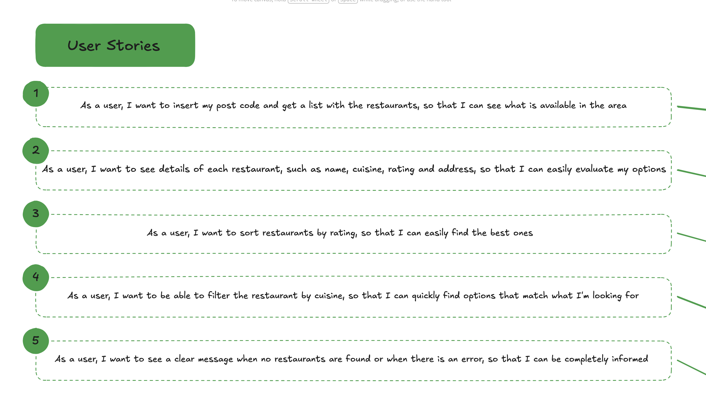
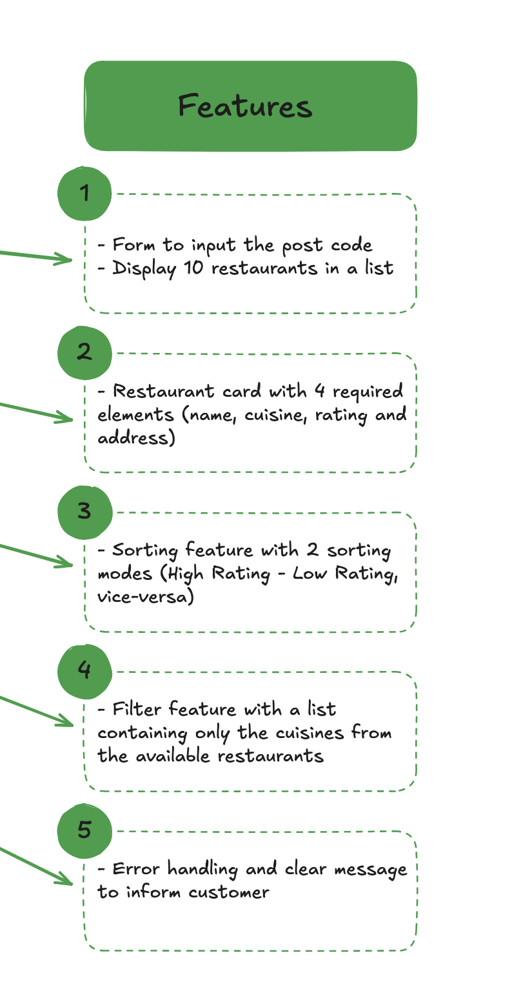
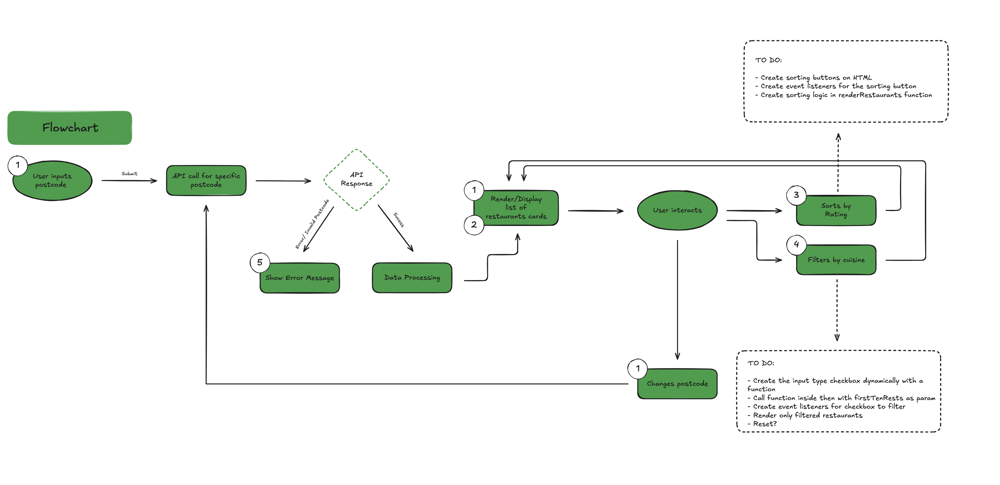
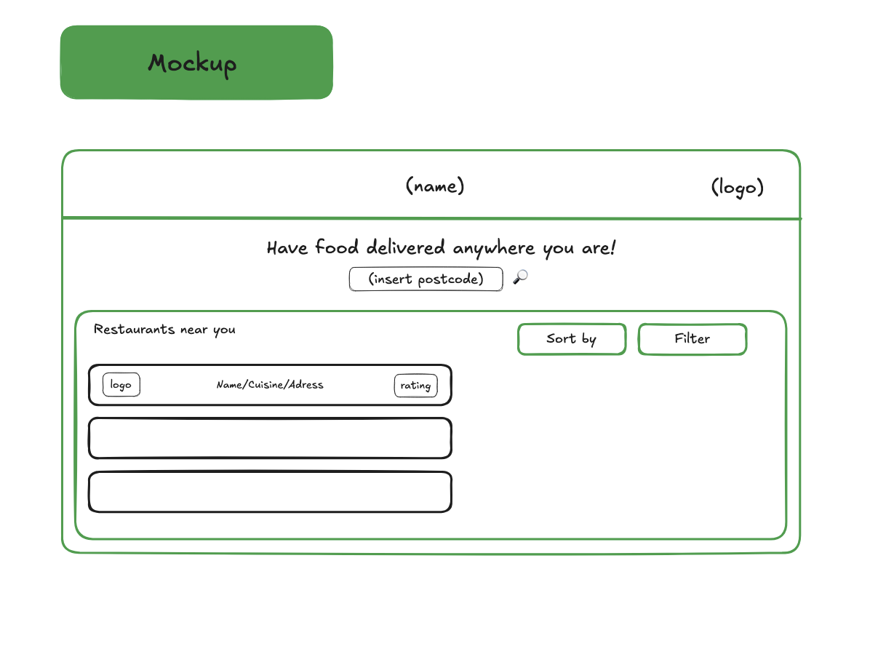
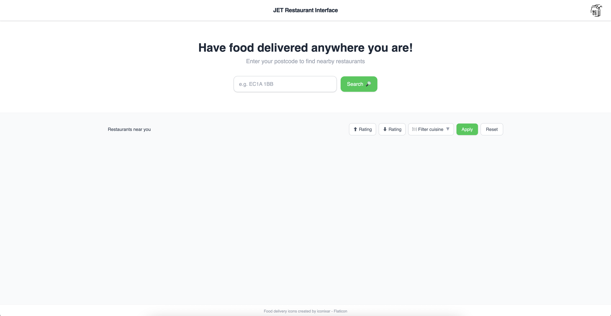
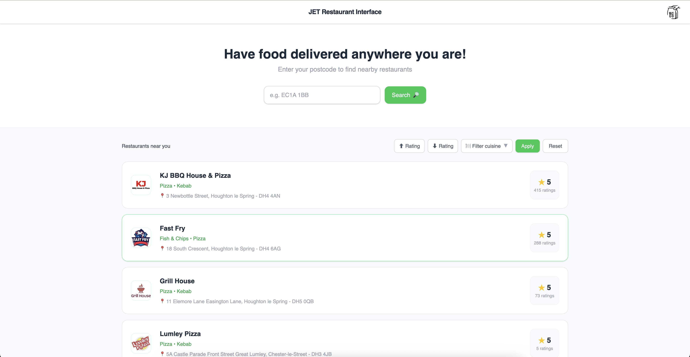
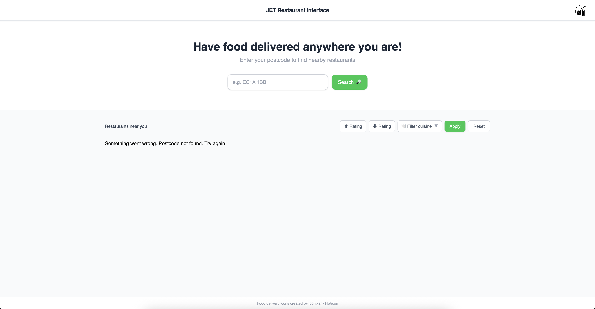

# JET Restaurant Interface

Hello, welcome to my proposed solution for JUST EAT TAKEAWAY technical assignment, I decided to make a simple interface using HTML, CSS and JavaScript.

---

## Tech Stack

- **Vite**
- **Tailwind CSS v4**
- **Vanilla JavaScript**
- **Vitest**

---

## Design Process

To begin this project, before writing any code, I needed to fully understand the user's perspective and brainstormed about what the user would want to see and do with it; and that's how I came up with the [user stories](https://excalidraw.com/?element=pMlRDtedZWk6Plr0HAJZ_) for this assignment:

1. **User Stories**
   ([view on Excalidraw](https://excalidraw.com/?element=pMlRDtedZWk6Plr0HAJZ_))

   

After that, I started to draft what would be the [main features](https://excalidraw.com/?element=8qwPc6mVMiDHzXVZ_wfU7) of the project.

2. **Feature Planning**
   ([view on Excalidraw](https://excalidraw.com/?element=8qwPc6mVMiDHzXVZ_wfU7))

   

Then, to visualise all the different actions a user can take and how the program will react, I put these features into a [flowchart.](https://excalidraw.com/?element=y0S3RakBM0FL7Kzxe9vin) , this helped me organise the code.

3. **Flowchart** — ([view on Excalidraw](https://excalidraw.com/?element=y0S3RakBM0FL7Kzxe9vin))



At last, to help me preview how it would look, I drafted a [mockup](https://excalidraw.com/?element=OAjABVIbdZGoX7Afgad1w)

4. **Mockup** — ([view on Excalidraw](https://excalidraw.com/?element=OAjABVIbdZGoX7Afgad1w))



[Link to complete Excalidraw](https://excalidraw.com/#json=i2bySfTZ4A_72CNbyC_v5,mWv5mrJYUbh0FgLONCd-eQ)

---

## Challenges

### CORS Handling

The first obstacle that I encountered was that the Just Eat API does not support direct browser requests due to CORS restrictions. I initially considered using a browser extension to disable cors protection or a public proxy, however, that would not be a good approach and it is not scalable.

So, after some research, I decided to use VITE on my project because it would allow me to use its proxy, which is safer and more convenient.

```js
// vite.config.js
export default defineConfig({
  plugins: [tailwindcss()],
  server: {
    proxy: {
      '/api': {
        target: 'https://uk.api.just-eat.io/',
        changeOrigin: true,
        rewrite: path => path.replace(/^\/api/, ''),
      },
    },
  },
});
```

### Invalid Postcode Detection

To handle this, I check whether the `restaurants` array in the response is empty and throw an error accordingly:

Another challenge that I faced was that the API returns a `200 OK` even for invalid postcodes (e.g 1234). To solve that, I noticed that some properties in the response would be empty, and I used this as a way to trigger an error warning.

https://github.com/GiChirico/jet-restaurant-interface/blob/main/src/main.js#L50

---

## Getting Started

### Prerequisites

- [Node.js](https://nodejs.org/) (v18+ recommended)
- npm

### Installation

Clone the repository:

```sh
git clone https://github.com/GiChirico/jet-restaurant-interface.git
cd jet-restaurant-interface
```

Install dependencies:

```sh
npm install
```

### Running the App

```sh
npm run dev
```

The app will be available at `http://localhost:5173` by default.

### Running Tests

```sh
npm test
```

> Tip: `npm run test` also works.

Once the app is up and running, you will see this page:



You can insert a valid UK postcode (e.g DH4 5GZ) and you'll see the results after clicking on the 'Search' button or pressing the ENTER key.



If you type an invalid postcode, you'll get an error message.


